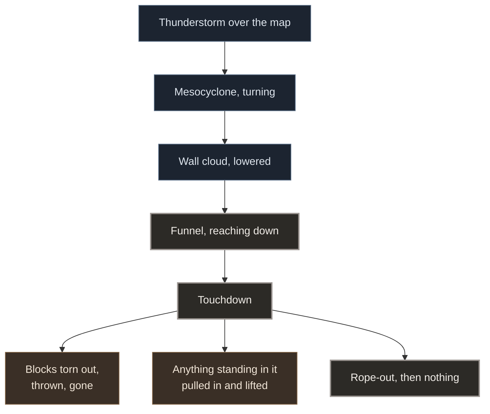

# Vortex Dread

A Fabric mod that puts real tornadoes in Minecraft. A supercell turns somewhere over the map, its base
lowers, and a funnel comes out of it and reaches the ground: a Rankine vortex with curl-noise turbulence
on top, rated EF0 to EF5, travelling, widening, roping out and dying. What it passes over is destroyed
and thrown, the sky lights itself from inside when the lightning fires, and the whole column is drawn
as cloud rather than as particles.



The funnel is not a particle effect and not a model. It is one box submitted to the renderer and one
fragment program that marches a cloud through it, with the same striations, the same lifted debris ring
at the foot and the same lowered base a photograph has. It works with no shader pack installed. With
Iris and a patched copy of Photon it also gets the pack's own cloud lighting, and the storm above it
gets lightning that lights the cloud from where the channel actually is instead of flashing the whole
sky by the same amount. The patch is in [`mod/patches/photon/`](mod/patches/photon/); Photon itself is
not redistributed here, the script reads your own copy and writes a second one beside it.

The heavy arithmetic goes to the graphics card through OpenCL, on a dedicated server exactly as on a
client, and falls back to the processor with identical results when no device answers.

Everything is configurable in `config/oas/vortexdread.json`, server side, 42 options: how often storms
form, how strong they get, how fast they travel, what they are allowed to break, how loud they are and
how much of the screen they take over. A server owner who wants tornadoes that never break a block gets
that from one line.

## Addons

Read the storms through `oas.dreyka.vortexdread.api.VortexDreadApi`: the live funnels in a level, the
nearest one to a point, the wind vector at any position, and one call to start a storm of your own.
Every funnel is a `TornadoView`, which answers position, rating, stage, wind, core radius and how much
of the ground it is carrying, and keeps answering as the storm moves.

Two events, both fired on the server thread. `TornadoLifeCallback` says when a funnel forms, when it
touches down and when it is over, which is what a warning system or a scoreboard wants.
`BlockTakenCallback` is asked before every block the storm takes and can refuse it, which is what a
claim mod needs: what a tornado takes is destroyed rather than dropped, so there is nothing to give
back afterwards.

Nothing has to be registered and no entrypoint has to be declared. Depend on the jar, call the API:

```kotlin
mappings(loom.officialMojangMappings())
modImplementation("net.fabricmc.fabric-api:fabric-api:0.141.4+1.21.11")
modImplementation(files("libs/vortexdread-1.0.0.jar"))
```

`modImplementation` rather than `implementation`, or Loom never remaps the jar and the compiler starts
reporting `cannot access class_2960` at you. Official Mojang mappings, because that is what every
signature in the API is written in. The full wiring, in both Gradle dialects, is on the site's
[addon page](https://vortexdread.pages.dev/lang/en/wiki/api.html).

## Running it

Minecraft 1.21.11, Fabric Loader 0.19.3 or newer, Fabric API. Java 21. Iris and a shader pack are
optional and change nothing about how the mod behaves.

The mod is in [`mod/`](mod/), the site in [`web/`](web/).

MIT, © 2026 Dreyka Oas. Play it, share it, fork it, build an addon on it and publish that addon, all
without asking. Keep the copyright and permission notice with any substantial copy of the code, which
is the whole of what MIT requires. See [LICENSE](LICENSE). A mention is welcome as a courtesy, never as
a condition.
